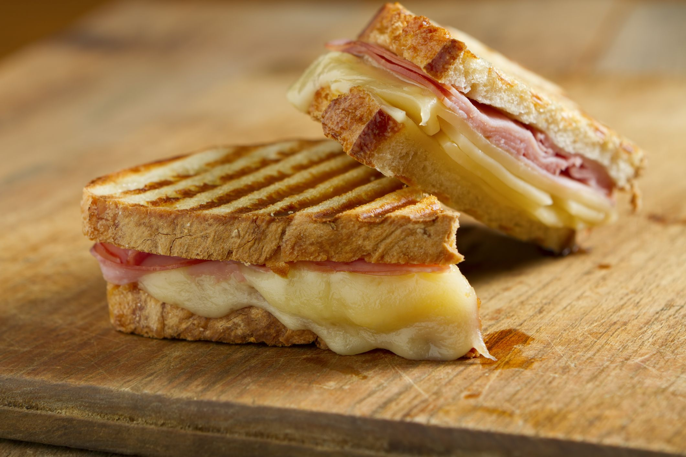

## Receta
# Sándwich de Jamón y Queso

### INGREDIENTES
> 1. Pan de sándwich (blanco o integral)
> 2. Jamón
> 3. Queso (cheddar, mozzarella, a preferencia)
> 4. Mantequilla o margarina (*opcional*)
> 5. Hojas de lechuga (*opcional*)
> 6. Rodajas de tomate (*opcional*)
> 7. Mostaza o mayonesa (*opcional*)
> 8. Sal y pimienta al gusto

### UTENSILIOS
> * Tabla de cortar
> * Cuchillo de cocina
> * Sartén o sandwichera (*opcional*)
> * Espátula o tenedor

### INSTRUCCIONES PASO A PASO
1. **Preparativos**:
> Se lavan las manos y se reúnen todos los ingredientes y utensilios necesarios.

2. **Abrir el pan**:
> Se abre la bolsa de pan con cuidado, sacando las rebanadas necesarias *sin romperlas*.

3. **Tostar el pan (*opcional*)**:
> Si se prefiere el pan crujiente, se tuesta un poco en una sartén o sandwichera durante un par de minutos hasta que se dore ligeramente.

4. **Preparar el sándwich**:
> - Se coloca una rebanada de queso sobre una rebanada de pan. 
> - Se ponen las lonchas de jamón encima del queso.
> - Si se desea, se añaden algunas hojas de lechuga y rodajas de tomate para darle un toque fresco.

5. **Añadir condimentos (*opcional*)**:
> - Si se prefiere, se unta un poco de mostaza o mayonesa en la otra rebanada de pan.
> - Se puede añadir un poco de sal y pimienta al gusto.

6. **Armar el sándwich**:
> - Se juntan las dos rebanadas de pan con los ingredientes en el medio.
> - Si se prefiere el pan dorado, se unta un poco de mantequilla o margarina en el exterior del sándwich.

7. **Cocinar el sándwich**:
> - Se calienta una sartén a fuego medio o se enciende la sandwichera.
> - Se coloca el sándwich en la sartén caliente o en la sandwichera y se cocina por unos 3-4 minutos por cada lado hasta que el pan esté dorado y el queso derretido.

8. **Servir**:
> - Se retira el sándwich de la sartén o sandwichera con una espátula o tenedor.
> - Se coloca en un plato y se corta por la mitad si se desea.

9. **Disfrutar**:
> ¡Listo! Se puede disfrutar de un delicioso sándwich de jamón y queso. Se recomienda probarlo mientras está caliente y acompañarlo con una bebida favorita.

**
Sándwich de Jamón y Queso
**